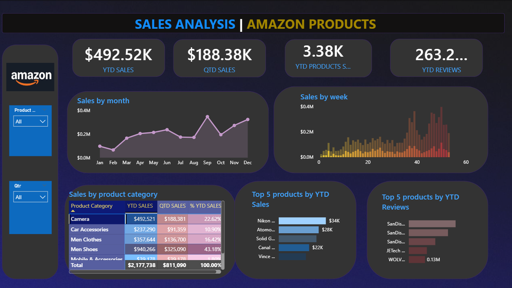

# Amazon Sales Analysis Dashboard using Power BI

## Project Overview
This project analyzes Amazon sales data using Power BI to identify sales trends, product performance, and customer insights through interactive dashboards and visualizations.

## Business Objective
To analyze Amazon sales performance and identify trends, customer behavior, and product insights for better buisness decision-making.

## Dataset
The dataset contains Amazon sales records including product categories, sales trends, customer reviews, and product performance metrics.

## Dashboard KPIs
- YTD Sales: $2.18M
- QTD Sales: $811K
- Total Products Sold: 27.75K
- YTD Reviews: 19.42M

## Technologies Used
- Power BI
- Excel
- Data Visualization
- Dashboard Design

## Dashboard Features
- Sales by Month Analysis
- Weekly Sales Trends
- Product Category Performance
- Top Products by Sales
- Top Products by Reviews
- Interactive Filters & Slicers
## Key Insights
- Small outlet size generated highest sales
- Customer review trends analyzed
- Product categories performance identified

## Conclusion
This dashboard helps understand business performance and supports data-driven decision-making using Power BI.
